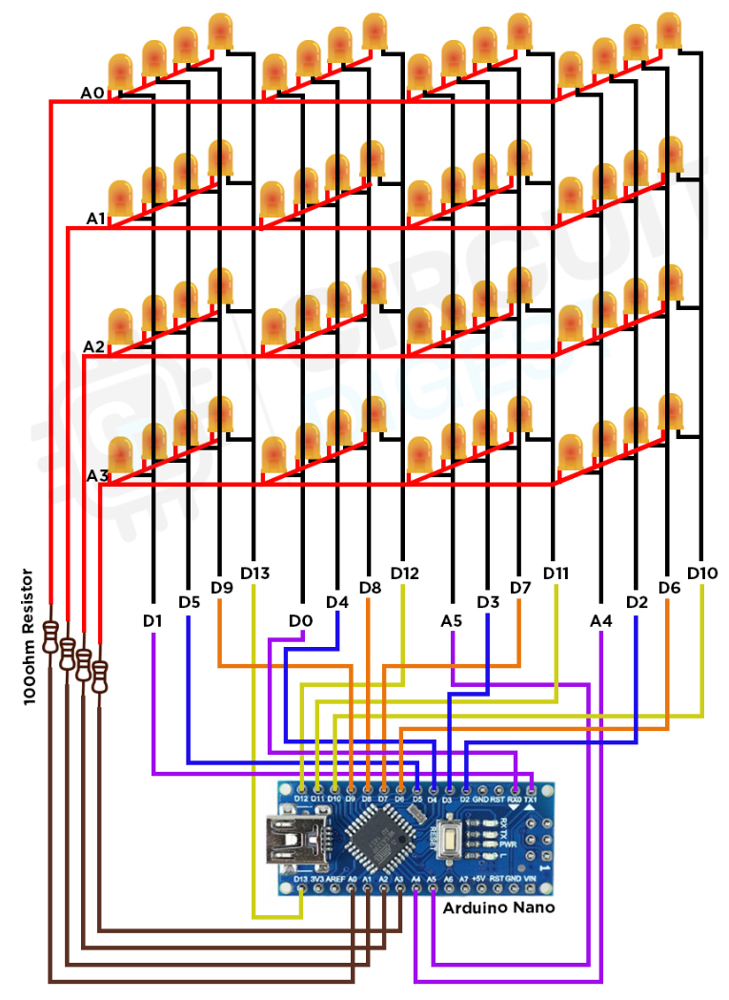

## Making 4x4 LED Cube Using Aurdino Board

### Required Components

- Arduino Nano
- 64- 5mm blue LEDs
- Female Headers
- Rainbow Ribbon cable
- 100Ω Resistor
- 3V battery to test the LED
- Zero PCB board
- Copper wire
- Tools (Soldering iron, Wirecutter, Sandpaper)

### Building a 4x4x4 LED Cube

### Connections With Arduino

