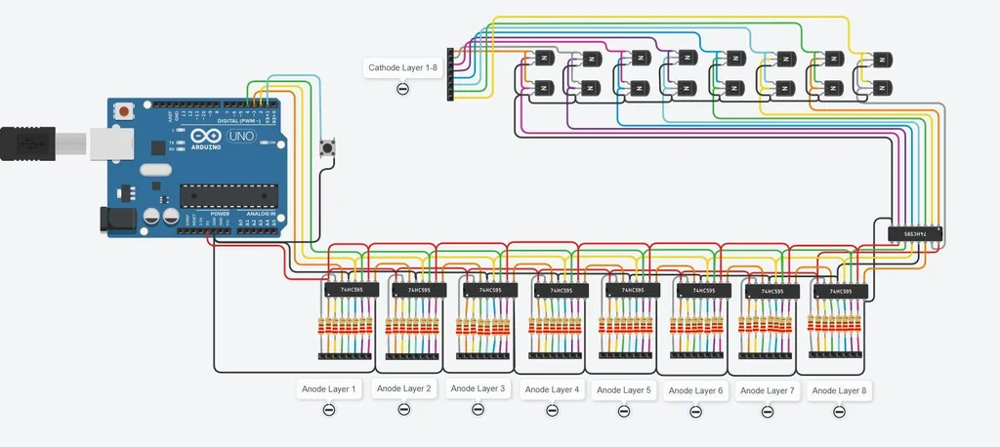

## 8x8 LED Matrix Cube
An 8x8x8 LED cube is a visual treat with 3D effects and patterns.It works on the concept of Persistence of Vision, a feature of the human eye which tricks our brain in to thinking that an object is present permanently at a place if it appear about 60 times in a second.

Since an 8x8x8 LED Cube consists of, well 8x8x8 = 512 LEDs, we cannot control all these 512 LEDs at once. What we can do is control 64 LEDs at a time at an extremely fast rate and trick our brain as if we were controlling all the 512 LEDs.

### Components
- LEDs x 512
- 21 AWG copper wire
- Wires/Ribbon wires
- PN2222 transistors x 16
- 220-ohm resistors x 64
- 74HC595 shift registers x 9
- Arduino Uno
- Pushbutton

### Tools
- Solder
- Soldering Iron
- Helping Hands
- Wire cutter
- Paint (for the box)
- Fan (for fresh air due soldering)

### Multiplexer Circuit
**Note: Please connect pin number 1 to Arduino D8 in the circuit it was a mistake shows D13**

Controller Circuit

PDF Verisons  
[Circuit Digram](./circuit.PDF)  
[Circuit Digram Controller](./controller-circuit.pdf)  

### References
[Video Tutorial](https://www.youtube.com/watch?v=JqBGBm2iza8)